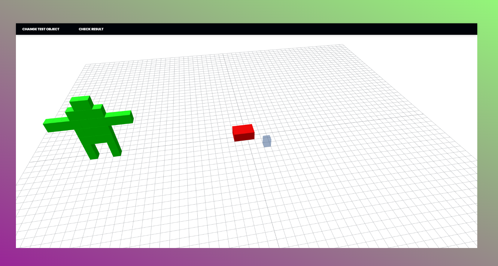
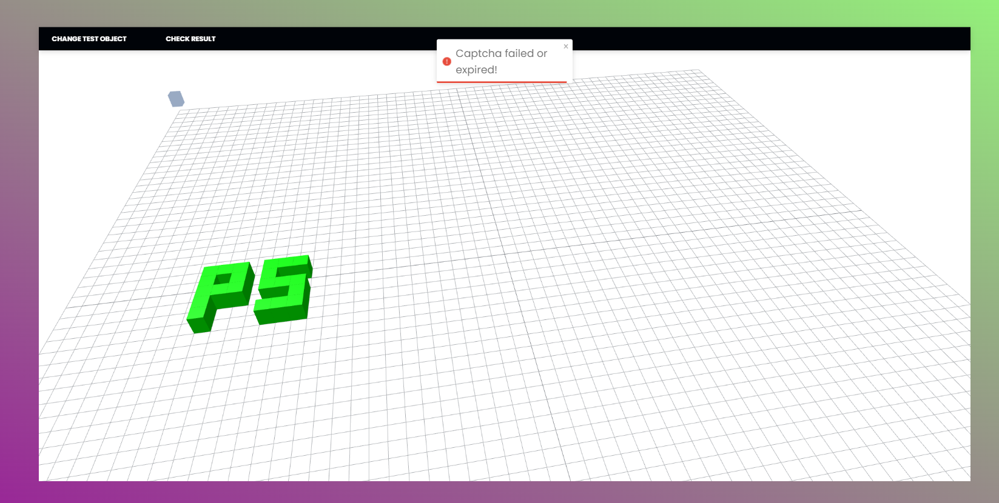
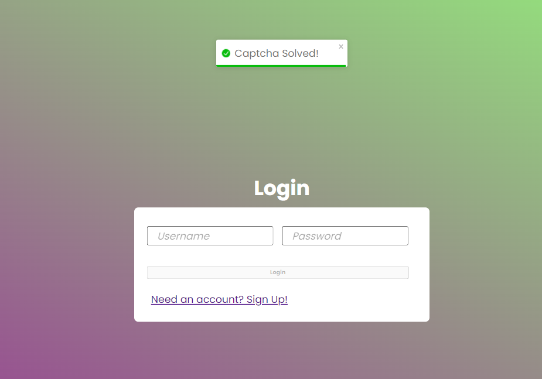
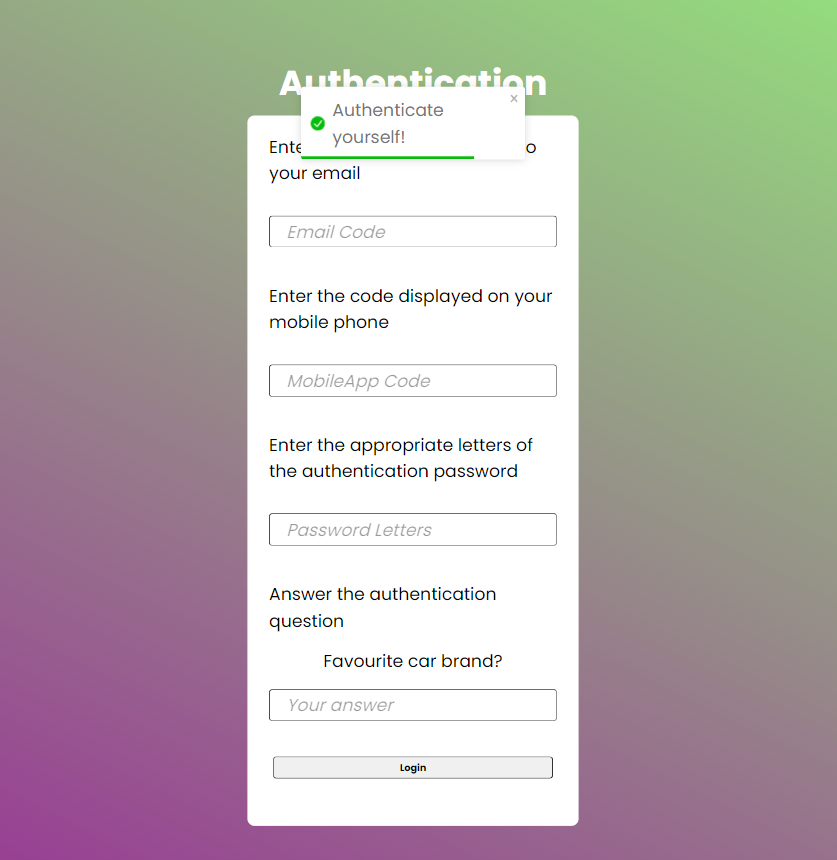
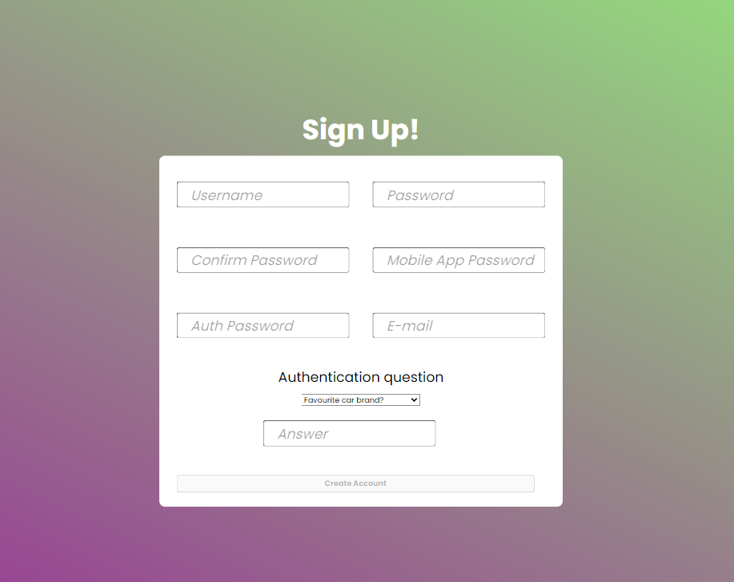

# Project Description

The project involves the development of an innovative authentication system that utilizes 3D modeling techniques. Within the project, efficient authentication methods have been developed, such as 3D captchas, access code generation, and their delivery via email and mobile application, etc. Additionally, a server security system has been implemented, including SSL certificate, hashing function for data integrity verification, and the use of JWT tokens for server-side actions, etc.

# Description of 3D Captcha

3D Captcha involves presenting the user with a three-dimensional scene in which they have to pass a test to confirm their identity as a human. The test requires the user to replicate the arrangement of cubes in 3D space based on the displayed pattern.

# Used Technologies:

Frontend: Typescript, React, threejs  
Backend: asp.net core  
Mobile App: .NET MAUI  
Database: MSSQL Express

# Screenshots:

| Image                                    | Image                                  |
| ---------------------------------------- | -------------------------------------- |
|       |     |
|       |        |
|  |  |
